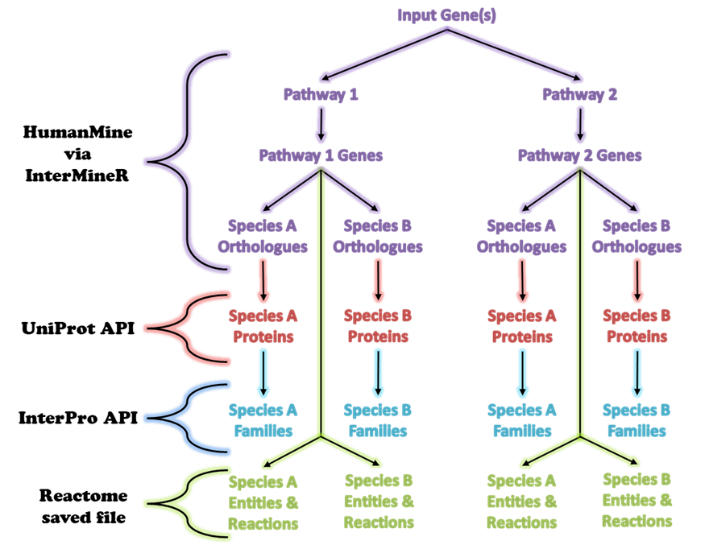
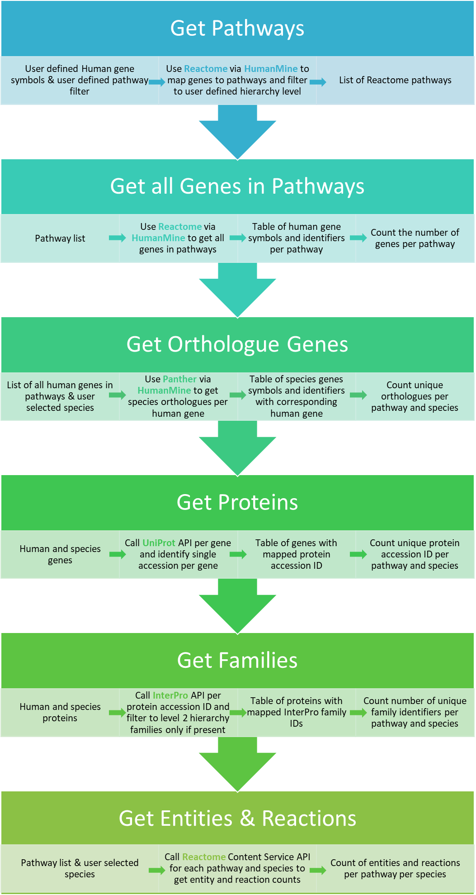
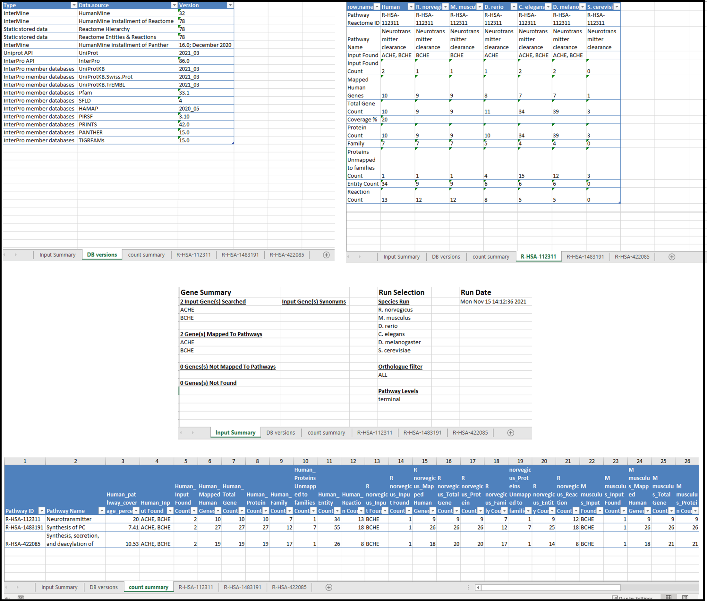
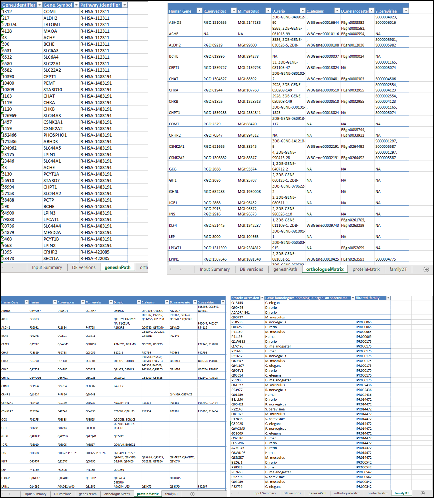

Genes2Pathways - Species Conservation Analysis Pipeline (G2P-SCAN)
================
Jade Houghton

- <a href="#g2p-scan" id="toc-g2p-scan">G2P-SCAN</a>
  - <a href="#installation" id="toc-installation">Installation</a>
  - <a href="#example" id="toc-example">Example</a>
    - <a href="#input-parameters" id="toc-input-parameters">Input
      parameters</a>
  - <a href="#output" id="toc-output">Output</a>
    - <a href="#rungenes2pathways-return"
      id="toc-rungenes2pathways-return">runGenes2Pathways Return</a>
    - <a href="#excel-outputs" id="toc-excel-outputs">Excel Outputs</a>
  - <a href="#breakdown-of-pipeline-functions"
    id="toc-breakdown-of-pipeline-functions">Breakdown of pipeline
    functions</a>
    - <a href="#getpathways" id="toc-getpathways"><code>getPathways</code></a>
    - <a href="#getgenes" id="toc-getgenes"><code>getGenes</code></a>
    - <a href="#getentitiesreactionscounts"
      id="toc-getentitiesreactionscounts"><code>getEntitiesReactionsCounts</code></a>
    - <a href="#getorthologuegenes"
      id="toc-getorthologuegenes"><code>getOrthologueGenes</code></a>
    - <a href="#getorthologuematrix"
      id="toc-getorthologuematrix"><code>getOrthologueMatrix</code></a>
    - <a href="#getproteins" id="toc-getproteins"><code>getProteins</code></a>
    - <a href="#getproteinmatrix"
      id="toc-getproteinmatrix"><code>getProteinMatrix</code></a>
    - <a href="#getfamilies" id="toc-getfamilies"><code>getFamilies</code></a>
    - <a href="#getfamilymatrix"
      id="toc-getfamilymatrix"><code>getFamilyMatrix</code></a>
    - <a href="#getallcounts"
      id="toc-getallcounts"><code>getAllCounts</code></a>
    - <a href="#writeoutput" id="toc-writeoutput"><code>writeOutput</code></a>
    - <a href="#writesupplementarydata"
      id="toc-writesupplementarydata"><code>writeSupplementaryData</code></a>
  - <a href="#resource-version-control"
    id="toc-resource-version-control">Resource Version Control</a>
    - <a href="#interpro-hierarchy-file"
      id="toc-interpro-hierarchy-file">InterPro Hierarchy File</a>
    - <a href="#reactome-files" id="toc-reactome-files">Reactome Files</a>
  - <a href="#running-in-parallel" id="toc-running-in-parallel">Running in
    Parallel</a>
- <a href="#license-and-copyright" id="toc-license-and-copyright">License
  and Copyright</a>

<!-- README.md is generated from README.Rmd. Please edit that file -->

# G2P-SCAN

<!-- badges: start -->
<!-- badges: end -->

**G**enes **to** **P**athways - **S**pecies **C**onservation
**An**alysis

G2P-SCAN pipeline has been developed to be a functionality driven
orthology analysis pipeline to link genes into pathways across species.
A publication describing the pipeline and its application can be found
here “link to paper”. Existing tools available to perform parts of the
required workflow cannot be easily used together manually. Thus, the
objective of this pipeline is to utilise existing databases and gather,
analyse and present necessary information in a quick and systematic way.
Given an input gene, the G2P-SCAN pipeline queries existing databases
through other R packages and APIs and constructs an output of the
conservation of relevant pathways. The wrapper function of this package
`runGenes2Pathways` runs the analysis as a pipeline and outputs an excel
workbooks of results. An overview of the pipeline run for an input gene
which maps to only 2 Reactome pathways and run to analyse the
conversation of only 2 species is depicted below:  
 The pipeline consists of four
different main steps:  
1. *Mapping human gene(s) to their known biological pathways:* the
pipeline uses human gene(s) input and retrieves relevant human
biological pathways in which input gene(s) are involved (based on latest
available human knowledge).  
2. *Identifying orthology across species:* the pipeline determines the
mapped orthologues for all annotated genes in the identified pathways in
the other queried species (i.e. rat, mouse, fish, fruitfly, worm,
yeast).  
3. *Retrieving information to infer gene conservation and
functionality*: protein families are inferred based on the gene
sequences/domains and used as a proxy for their function and role within
the pathway. This approach offers a more relevant metric of relative
functional conservation within a given pathway, than the individual gene
assessment. At this stage, the number of entities (i.e. nucleic acids,
proteins, complexes and small molecules) and reactions (i.e. molecular
events) from Reactome are also retrieved as a different metric to assess
pathways conservation.  
4. *Data output*: the pipeline organises the information showing pathway
coverage across the selected species, based on the number of orthologues
genes, proteins, assigned/ unassigned families, and molecular entities
and reactions associated to each pathway, ready for subsequent
analysis.  
**(cite paper)**

Output of the pipeline includes a count summary data of each of the data
type, genes, proteins, protein families, entities and reactions,
collected for each pathway and each species analysed. Lists of
genes/orthologues, proteins and protein families which are counted can
be saved for further analysis.

## Installation

This package is currently not released on CRAN so it can be installed
from Github with:

``` r
install.packages("devtools")
library(devtools)
devtools::install_github("seacunilever/G2P-SCAN")
```

## Example

The `runGenes2Pathways` function is the wrapper function, calling all
functions representing each step of the G2P-SCAN pipeline (see figure
below).  The function will first
map the input gene(s) to Reactome pathways, get all genes found in those
pathways and get all given orthologues for the species selected for the
analysis, all using R package InterMineR. All orthologues are then
queried using the UniProt protein API to determine a corresponding
protein for the gene if available, these are then queried using the
InterPro API to map the given proteins to functional families. A file of
entities and reactions for all species is then created and used, derived
from Reactome, of all Human pathways of entities and reactions counts
for each species. Counts of entities and reactions are pulled from this
file for each of the mapped pathways and species of interest for the
final output. All Human genes and species orthologues are counted per
mapped pathway as well as the corresponding proteins and functional
families for a final output.

``` r
library(Genes2Pathways)
library(parallel) # for detectCores() 
ACHE_BCHE_T_ALL <- runGenes2Pathways(inputGenes = c("ACHE", "BCHE"),
                                     pathwayLevels = c("terminal"),
                                     species = NULL,
                                     orthologueFilter = "ALL",
                                     orthologueOutput = "both",
                                     cores = (detectCores() - 1), 
                                     g2pScanData = ".",
                                     outputDir = "example_dir",
                                     outputPrefix = "example",
                                     pathwaysTabs = TRUE,
                                     countSummary = TRUE,
                                     versions = TRUE,
                                     inputSummary = TRUE,
                                     reactomeOnMissingUpdate = "update",
                                     useSynonyms = FALSE)
```

### Input parameters

- `inputGenes`
  - Character vector of gene symbols which the analysis should run
- `pathwayLevels`
  - o Character vector of any combination of “parental”, “intermediate”
    and “terminal” where each level determines which pathways of the
    Reactome pathway hierarchy, which the `inputGenes` are found in,
    will be analysed using the pipeline.
- `species`
  - Character vector of species to run the analysis on. Species
    available for analysis are
    - R. *norvegicus*
    - M. *musculus*
    - D. *rerio*
    - C. *elegans*
    - D. *melanogaster*
    - S. *cerevisiae*
  - When NULL is used, all available species shall be analysed
- `orthologueFilter`
  - String “ALL” or “LDO” indicating whether orthologues to be counted
    in analysis should include all available orthologues or those
    identified as “least divergent orthologues” from the Panther
    database used within HumanMine
- `orthologueOutput`
  - String “primaryIdentifier”, “geneSymbol” or “both” determining how
    orthologues should be written as in the output matrix of orthologues
    in the data excel file. When “both” is given, orthologues will be
    written as ‘primaryIdentifier(geneSymbol)’ as such
    “RGD:619996(Bche)”
- `cores`
  - The processes to get proteins and families can be slow when run on a
    single cluster as API queries are made per gene or protein. To
    decrease analysis time these functions can be run in parallel by
    creating clusters on a number of cores given by the parameter
- `g2pScanData`
  - The directory path where the directory ‘g2pScanData’ can be found or
    should be written. This directory will be where static files will be
    searched for or written to, see section [Resource Version
    Control](#resource-version-control)
- `outputDir`
  - The output directory where excel output files should be written.
    Directory will be created if it does not currently exist
- `outputPrefix`
  - Character string which the output files should be prefixed as. Files
    will be named ‘outputPrefix_counts.xlsx’ and
    ‘outputPrefix_data.xlsx’
- `pathwaysTabs`
  - Boolean indicating whether tabs of counts should be created per
    pathway in the counts excel file
- `countSummary`
  - Boolean indicating whether a full count summary tab should be
    created in the counts excel file, including all pathways as rows and
    species data types as columns
- `versions`
  - Boolean indicating whether versions of databases and resources used
    should be outputted as a tab in both the counts and data excels
    files
- `inputSummary`
  - Boolean indicating whether a summary of the inputs to the analysis
    (input genes, species and filtering options) should be outputted as
    a tab in both the counts and data excel files
- `reactomeOnMissingUpdate`
  - Character string to indicate what to do when Reactome files (for
    pathway hierarchy and entity and reaction counts) cannot be updated
    to appropriate version. Either “update” to use the Reactome API most
    up to date version. “use latest” to use the most up to date version
    of the file saved in the g2pScanData appropriate repository already
    or an integer to state what version of Reactome file to use - this
    must be already present in the g2pScanData appropriate repository
- `useSynonyms`
  - Boolean value indicating when an inputted gene string is not
    identified as predominant symbol for a gene in HumanMine whether the
    identified main synonym should be used instead. TRUE will use
    synonyms when dominant gene symbol is found instead

## Output

### runGenes2Pathways Return

The function will return a list of outputs created by the packages main
functions found in the next section. Items found in the list of outputs
are as below:  
- `pathways` output of function `getPathways`  
- `genes_in_path` output of function `getGenes`  
- `entities_reactions` output of function `getEntitiesReactionsCounts`  
- `orthologue_genes` output of function `getOrthologueGenes`  
- `orthologue_matrix` output of function `getOrthologueMatrix`  
- `proteins` output of function `getProteins`  
- `protein_matrix` output of function `getProteinMatrix`  
- `families` output of function `getFamilies`  
- `family_matrix` output of function `getFamilyMatrix`  
- `all_counts` output of function `getAllCounts`

### Excel Outputs

The `getAllCounts` function will also output 2 excel files which have
some customisation (controlled by parameters `pathwaysTabs`,
`countSummary`, `versions` and `inputSummary`). Although the data file
provides the data points behind the count values for each data type, we
recommend the output of `runGenes2Pathways` is saved as a Rdata file for
full transparency.

**Counts file**  
The counts file shows the number of each data type for the pathways and
species run. In this file you can output a tab for the input summary (a
summary of parameters used in the analysis), DB versions (versions of
databases and resources used in the analysis), count summary (the counts
for each data type for every pathway and species in the analysis) and
finally a tab for each identified pathway in the analysis with counts
for that pathway.  
 \* *DB version shown here
may not match the version of the DB used in examples displayed
throughout this document*

**Data file**  
This file contains essentially the data behind the final counts,
presented in the count file. It includes the genes included in each
pathway identified by the human gene(s) input, the orthologues mapped to
human genes, the proteins per human gene/protein and families assigned
to each protein. Input summary and DB version tabs for this output is
the same as in the count output.  


## Breakdown of pipeline functions

In order to run the whole pipeline from a gene input to creating an
output of counts for all genes, proteins, families, entities, and
reactions across the selected species for all mapped pathways, the
function `runGenes2Pathways` should be run. In `runGenes2Pathways` the
following functions are called to create the pipeline workflow:  
- `getPathways`  
- `getGenes`  
- `getEntitiesReactionsCounts`  
- `getOrthologueGenes` - `getOrthologueMatrix`  
- `getProteins`  
- `getProteinMatrix`  
- `getFamilies`  
- `getFamilyMatrix`  
- `getAllCounts`  
- `writeOutput`  
- `writeSupplementaryData`

Below, we provide details on what these functions do, assumptions and
filtering processes the functions apply as well as the resource each
function relies on. **It is important to understand how pathways,
proteins and families are filtered and selected for counting in the
pipeline for correct interpretation of results.**

### `getPathways`

This is the first step of the pipeline where input genes are mapped to
pathways. Using InterMineR to query HumanMine (using template
‘Gene_Pathway’), the `getPathways` function identifies all Reactome
pathways in which any of the input genes queried to the function are
found. The user will have the choice to select which pathway level(s) to
include in the analysis across Parental, Intermediate and Terminal
pathways. Pathways which contain any of the queried input genes are
filtered based on the user pathwayLevel parameter input. The Reactome
pathway hierarchy is used to determine hierarchy level of the selection
of pathways (see section [Resource Version
Control](#resource-version-control) to understand how the hierarchy is
stored and updated). Parental level pathways are defined as those which
have children in the hierarchy of selected pathways but do not have any
parent themselves. Terminal level pathways are defined as those which
have parent pathways, but no children, and intermediate pathways have
both parent and children pathways. The level of a pathway is determined
by its relative position in the hierarchy considering only the pathways
identified by the input genes and not based on the full Reactome
hierarchy of all pathways. All options/ combinations have their
advantages, and the choice will depend on the purpose of the analysis by
the end user, but it should be considered the more pathways run through
the analysis the longer the run time of the pipeline.

**Return example**

``` r
knitr::kable(ACHE_BCHE_T_ALL$pathways)
```

|     | Derived Gene | Pathways                                         | Derived Database | Pathway Identifier | Pathway Level | Pathway Link                                        | Input Gene Count |
|:----|:-------------|:-------------------------------------------------|:-----------------|:-------------------|:--------------|:----------------------------------------------------|-----------------:|
| 12  | ACHE         | Neurotransmitter clearance                       | reactome         | R-HSA-112311       | terminal      | <https://reactome.org/content/detail/R-HSA-112311>  |                2 |
| 18  | ACHE         | Synthesis of PC                                  | reactome         | R-HSA-1483191      | terminal      | <https://reactome.org/content/detail/R-HSA-1483191> |                2 |
| 20  | ACHE         | Synthesis, secretion, and deacylation of Ghrelin | reactome         | R-HSA-422085       | terminal      | <https://reactome.org/content/detail/R-HSA-422085>  |                2 |
| 24  | BCHE         | Aspirin ADME                                     | reactome         | R-HSA-9749641      | terminal      | <https://reactome.org/content/detail/R-HSA-9749641> |                1 |
| 38  | BCHE         | Neurotransmitter clearance                       | reactome         | R-HSA-112311       | terminal      | <https://reactome.org/content/detail/R-HSA-112311>  |                2 |
| 44  | BCHE         | Synthesis of PC                                  | reactome         | R-HSA-1483191      | terminal      | <https://reactome.org/content/detail/R-HSA-1483191> |                2 |
| 46  | BCHE         | Synthesis, secretion, and deacylation of Ghrelin | reactome         | R-HSA-422085       | terminal      | <https://reactome.org/content/detail/R-HSA-422085>  |                2 |

### `getGenes`

All human genes mapped into the pathways of interest are retrieved. The
`getGenes` function takes a list of Reactome pathway identifiers (when
run within `runGenes2Pathways` this will be the unique list of values
from the ‘Pathway Identifier’ column of the `getPathways` output) and
queries HumanMine via the R package InterMineR (using template
‘PathwayGenes’) to get all genes found in the given pathways. The
function returns the InterMine gene identifier, gene symbol and pathway
identifier the gene belongs to in a long data frame format.  
**Return example**

``` r
  knitr::kable(head(ACHE_BCHE_T_ALL$genes_in_path)) ## subset of results
```

| Gene Identifier | Gene Symbol | Pathway Identifier |
|:----------------|:------------|:-------------------|
| 1312            | COMT        | R-HSA-112311       |
| 217             | ALDH2       | R-HSA-112311       |
| 220074          | LRTOMT      | R-HSA-112311       |
| 4128            | MAOA        | R-HSA-112311       |
| 43              | ACHE        | R-HSA-112311       |
| 590             | BCHE        | R-HSA-112311       |

### `getEntitiesReactionsCounts`

Entity and Reaction counts are pulled from Reactome using the Reactome
APIs
(<https://reactome.org/AnalysisService/species/homoSapiens/speciesCode?sortBy=ENTITIES_PVALUE&order=ASC&resource=TOTAL&pValue=1>,
<https://reactome.org/ContentService/data/pathway/path_id/containedEvents>,
<https://reactome.org/ContentService/data/participants/pathway/referenceEntities>).
Counts for all available pathways and species are extracted at one time
and results are saved to a static csv file within the g2pScanData
directory (see section [Resource Version
Control](#resource-version-control) to understand how the entity and
reaction file is stored and updated). The `getEntitiesReactionsCounts`
function reads the saved csv and filters the data frame to the queried
species and pathways of interest.  
**Return example**

``` r
  knitr::kable(ACHE_BCHE_T_ALL$entities_reactions)
```

|               | Human_entities | R. norvegicus_entities | M. musculus_entities | D. rerio_entities | C. elegans_entities | D. melanogaster_entities | S. cerevisiae_entities | Human_reactions | R. norvegicus_reactions | M. musculus_reactions | D. rerio_reactions | C. elegans_reactions | D. melanogaster_reactions | S. cerevisiae_reactions |
|:--------------|---------------:|-----------------------:|---------------------:|------------------:|--------------------:|-------------------------:|-----------------------:|----------------:|------------------------:|----------------------:|-------------------:|---------------------:|--------------------------:|------------------------:|
| R-HSA-112311  |             36 |                      9 |                    9 |                 7 |                   6 |                        5 |                      0 |              16 |                      15 |                    15 |                 14 |                    7 |                         6 |                       0 |
| R-HSA-1483191 |             55 |                     25 |                   25 |                23 |                  13 |                       13 |                      9 |              18 |                      18 |                    18 |                 17 |                   10 |                        11 |                       6 |
| R-HSA-422085  |             26 |                     14 |                   14 |                13 |                   2 |                        1 |                      0 |               8 |                       8 |                     8 |                  7 |                    1 |                         1 |                       0 |
| R-HSA-9749641 |             80 |                     25 |                   28 |                12 |                   8 |                        6 |                      1 |              26 |                      12 |                    12 |                  9 |                    6 |                         5 |                       1 |

### `getOrthologueGenes`

Orthologues of a list of human genes for all selected species are
retrieved. The `getOrthologueGenes` function takes the list of human
gene symbols identified by getGenes and the chosen species to find
orthologues together with the orthologue filter value (Least Divergent
Orthologues (LDO) / All Orthologues (ALL)), both following the option
selected by the user on input. When run in function `runGenes2Pathways`,
the full list of genes found in all pathways is passed to this function.
InterMineR is called (using template ‘Gene_Orth’) to retrieve
orthologues available in the HumanMine database for all genes given in
the input. The output of the InterMineR query is then filtered to only
include species of interest and then if the orthologue filter is equal
to LDO then orthologues are filter to only be of this type, otherwise in
the case of ALL, all orthologues identified would be considered.
Filtering for only LDOs will meant only the most nearly “equivalent”
gene in another organism is selected (in case of gene duplications for
instance). An LDO for a given gene may not exist (output is zero), as
well a gene may have several orthologues (output is \>1). Data returned
includes the human gene primary identifier from HumanMine, human gene
symbol, the orthologue primary identifier and gene symbol, the species
of the orthologue and orthologue type.  
**Return example**

``` r
  knitr::kable(head(ACHE_BCHE_T_ALL$orthologues_genes)) #subset of results
```

|     | Gene.primaryIdentifier | Gene.symbol | Gene.homologues.homologue.primaryIdentifier | Gene.homologues.homologue.symbol | Gene.homologues.homologue.organism.shortName | Gene.homologues.type      |
|:----|:-----------------------|:------------|:--------------------------------------------|:---------------------------------|:---------------------------------------------|:--------------------------|
| 1   | 1312                   | COMT        | MGI:88470                                   | Comt                             | M. musculus                                  | least diverged orthologue |
| 2   | 1312                   | COMT        | RGD:2379                                    | Comt                             | R. norvegicus                                | least diverged orthologue |
| 3   | 1312                   | COMT        | ZDB-GENE-050913-117                         | Gene symbol not found            | D. rerio                                     | least diverged orthologue |
| 6   | 217                    | ALDH2       | FBgn0012036                                 | Gene symbol not found            | D. melanogaster                              | least diverged orthologue |
| 7   | 217                    | ALDH2       | MGI:99600                                   | Aldh2                            | M. musculus                                  | least diverged orthologue |
| 8   | 217                    | ALDH2       | RGD:69219                                   | Aldh2                            | R. norvegicus                                | least diverged orthologue |

### `getOrthologueMatrix`

A matrix containing the list of human genes and their orthologues per
species is generated. The `getOrthologueMatrix` function takes the
output of `getOrthologueGenes` and transforms it into a matrix where
human genes are given as rows and columns are the species selected for
analysis. Each cell contains either primary ID, gene symbol or both
primary ID and gene symbol (based on parameter input) of the orthologue
for the given human gene (row) and species (column) if available.

**Return example**

``` r
  knitr::kable(head(ACHE_BCHE_T_ALL$orthologue_matrix)) #subset of results
```

|        | R. norvegicus      | M. musculus        | D. rerio                                                                               | C. elegans                                                                                                                                                                                                                                                                                                                                                                                                                                                                                                                | D. melanogaster                                                                                                                                                                                                                                                                                                                                                                                            | S. cerevisiae                                                                                                                              |
|:-------|:-------------------|:-------------------|:---------------------------------------------------------------------------------------|:--------------------------------------------------------------------------------------------------------------------------------------------------------------------------------------------------------------------------------------------------------------------------------------------------------------------------------------------------------------------------------------------------------------------------------------------------------------------------------------------------------------------------|:-----------------------------------------------------------------------------------------------------------------------------------------------------------------------------------------------------------------------------------------------------------------------------------------------------------------------------------------------------------------------------------------------------------|:-------------------------------------------------------------------------------------------------------------------------------------------|
| ABCC2  | RGD:2366(Abcc2)    | MGI:1352447(Abcc2) | ZDB-GENE-040426-1523(Gene symbol not found)                                            | WBGene00003409(Gene symbol not found), WBGene00003410(Gene symbol not found), WBGene00003413(Gene symbol not found), WBGene00003414(Gene symbol not found)                                                                                                                                                                                                                                                                                                                                                                | FBgn0028675(Gene symbol not found), FBgn0032456(Gene symbol not found)                                                                                                                                                                                                                                                                                                                                     | S000001027(Gene symbol not found), S000002542(Gene symbol not found), S000003938(Gene symbol not found), S000003971(Gene symbol not found) |
| ABCC3  | RGD:71101(Abcc3)   | MGI:1923658(Abcc3) | ZDB-GENE-050517-16(Gene symbol not found)                                              | WBGene00003407(Gene symbol not found), WBGene00003408(Gene symbol not found)                                                                                                                                                                                                                                                                                                                                                                                                                                              |                                                                                                                                                                                                                                                                                                                                                                                                            | S000003513(Gene symbol not found)                                                                                                          |
| ABHD3  | RGD:1310655(Abhd3) | MGI:2147183(Abhd3) | ZDB-GENE-040912-90(Gene symbol not found)                                              | WBGene00013358(Gene symbol not found), WBGene00016644(Gene symbol not found)                                                                                                                                                                                                                                                                                                                                                                                                                                              | FBgn0033382(Gene symbol not found)                                                                                                                                                                                                                                                                                                                                                                         | S000000381(Gene symbol not found), S000004823(Gene symbol not found), S000006016(Gene symbol not found)                                    |
| ACHE   |                    |                    | ZDB-GENE-030131-9563(Gene symbol not found), ZDB-GENE-061013-99(Gene symbol not found) | WBGene00001578(Gene symbol not found), WBGene00010116(Gene symbol not found), WBGene00011362(Gene symbol not found), WBGene00011364(Gene symbol not found), WBGene00013540(Gene symbol not found), WBGene00013873(Gene symbol not found), WBGene00013874(Gene symbol not found), WBGene00013875(Gene symbol not found), WBGene00017478(Gene symbol not found), WBGene00019477(Gene symbol not found), WBGene00020125(Gene symbol not found), WBGene00020330(Gene symbol not found), WBGene00020891(Gene symbol not found) | FBgn0000326(Gene symbol not found), FBgn0000592(Gene symbol not found), FBgn0000594(Gene symbol not found), FBgn0004108(Gene symbol not found), FBgn0010052(Gene symbol not found), FBgn0027584(Gene symbol not found), FBgn0029690(Gene symbol not found), FBgn0031327(Gene symbol not found), FBgn0032132(Gene symbol not found), FBgn0033943(Gene symbol not found), FBgn0034076(Gene symbol not found) |                                                                                                                                            |
| ACSM2A | RGD:708383(Acsm2)  | MGI:2385289(Acsm2) | ZDB-GENE-080220-22(Gene symbol not found)                                              |                                                                                                                                                                                                                                                                                                                                                                                                                                                                                                                           |                                                                                                                                                                                                                                                                                                                                                                                                            |                                                                                                                                            |
| ACSM2B | RGD:708383(Acsm2)  | MGI:2385289(Acsm2) | ZDB-GENE-080220-22(Gene symbol not found)                                              |                                                                                                                                                                                                                                                                                                                                                                                                                                                                                                                           |                                                                                                                                                                                                                                                                                                                                                                                                            |                                                                                                                                            |

### `getProteins`

Protein identifiers are assigned to each gene given to the function
(including all human and orthologue genes when run in
`runGenes2Pathways`) using UniProt’s protein API. The `getProteins`
function uses the list of genes from the output of `getOrthologueGenes`
function as this includes assignment of species per gene and both gene
primary identifiers and gene symbols. The UniProt protein API is called
multiple times to ensure proteins are found if available in the UniProt
database, queries proceed as follows:

1.  Query UniProt protein API using database type and database
    identifier of the gene primary IDs. API URL:
    <https://www.ebi.ac.uk/proteins/api/proteins/database:priID?offset=0&size=-1>
    where `database` is ‘GeneID’,‘RGD’, ‘MGI’, ‘ZFIN’, ‘WormBase’,
    ‘FlyBase’ or ‘SGD’ for Human, R. *norvegicus*, M. *musculus*, D.
    *rerio*, C. *elegans*, D. *melanogaster* and S. *cerevisiae*
    respectively and `priID` is the primary ID of the gene to be
    searched. When the primary ID starts with ‘ENSMUSG’ then database is
    set to ‘Emsembl’.  
2.  When no protein accession is assigned to gene in step 1, query
    UniProt protein API using taxonomy. API URL:
    <https://www.ebi.ac.uk/proteins/api/proteins?offset=0&size=-1&exact_gene=geneSymbol&taxid=taxID#>
    where `taxID` is the taxonomy code of the species of the gene
    queried and `geneSymbol` is the gene symbol of the gene if
    available, if gene symbol is not available then the primary
    identifier is re-used. If a primary identifier being used starts
    with “Dmel\_” or “CELE\_”, these prefixes are removed before
    searching.

To assign one unique protein identifier to gene results, both API calls
are filtered to match the taxonomy ID of the species searched. When more
than one protein has been found, they are further filtered using the
sequential priority criteria for protein accession as shown in the
selection below:  
1. Reviewed UniProt entries (if no reviewed entries are present
un-reviewed data is used instead)  
2. Strongest evidence of existence. High-low: Experimental evidence at
protein level, Experimental evidence at transcript level, Protein
inferred from homology, Protein predicted, Protein uncertain  
3. Longest sequence  
4. Version 1 of sequence  
5. The first result of the remaining data

Proteins selected for genes are given as UniProt accession IDs.

**Return example**

``` r
  knitr::kable(head(ACHE_BCHE_T_ALL$proteins)) # subset of results
```

|     | Gene.symbol | Gene.homologues.homologue.primaryIdentifier | Gene.homologues.homologue.organism.shortName | Gene.homologues.homologue.symbol | search_term         | protein.accession |
|:----|:------------|:--------------------------------------------|:---------------------------------------------|:---------------------------------|:--------------------|:------------------|
| 1   | COMT        | MGI:88470                                   | M. musculus                                  | Comt                             | MGI:88470           | O88587            |
| 2   | COMT        | RGD:2379                                    | R. norvegicus                                | Comt                             | RGD:2379            | P22734            |
| 3   | COMT        | ZDB-GENE-050913-117                         | D. rerio                                     | Gene symbol not found            | ZDB-GENE-050913-117 | F4ZGF2            |
| 6   | ALDH2       | FBgn0012036                                 | D. melanogaster                              | Gene symbol not found            | FBgn0012036         | Q9VLC5            |
| 7   | ALDH2       | MGI:99600                                   | M. musculus                                  | Aldh2                            | MGI:99600           | P47738            |
| 8   | ALDH2       | RGD:69219                                   | R. norvegicus                                | Aldh2                            | RGD:69219           | P11884            |

### `getProteinMatrix`

A matrix containing the list of human gene identifiers and their
respective selected proteins per each species is generated. The
`getProteinMatrix` function takes the output of `getProteins` and
transforms it into a matrix where human genes are provided as rows and
in columns are the species (including human) selected for analysis. Each
cell contains the UniProt accession ID for the protein for the given
human gene (row) and species (column).  
**Return example**

``` r
  knitr::kable(head(ACHE_BCHE_T_ALL$protein_matrix)) # subset of results
```

|        | Human  | R. norvegicus | M. musculus | D. rerio       | C. elegans                                                                                                 | D. melanogaster                                                                        | S. cerevisiae                  |
|:-------|:-------|:--------------|:------------|:---------------|:-----------------------------------------------------------------------------------------------------------|:---------------------------------------------------------------------------------------|:-------------------------------|
| ABCC2  | Q92887 | Q63120        | Q8VI47      | F1DB26         | Q19048, G5EFP3, Q9U2G5, Q9XW61                                                                             | Q9VL32, Q7KTC0                                                                         | P38735, P39109, P14772, P32386 |
| ABCC3  | O15438 | O88563        | B2RX12      | NA             | Q95QE2, Q20943                                                                                             | NA                                                                                     | P53049                         |
| ABHD3  | Q8WU67 | A0A8I5ZSG0    | Q91ZH7      | Q66HU2         | Q9U1Z6, Q18610                                                                                             | A1Z7Q7                                                                                 | P38295, Q03649, Q02891         |
| ACHE   | P22303 | NA            | NA          | Q1LUZ9, Q08BF1 | Q04457, Q8MQ23, O01302, P92016, Q9XW75, Q23268, H9G2Y9, G5EDJ7, A0A1C3NSL8, Q21266, Q22008, H2L0K7, Q4LDP0 | Q9W2F4, P08171, P18167, P23654, Q9BMT7, Q9Y141, Q8MZ17, Q9VPZ5, Q9VLA3, Q8T016, A1ZA97 | NA                             |
| ACSM2A | Q08AH3 | O70490        | Q8K0L3      | A9JRA7         | NA                                                                                                         | NA                                                                                     | NA                             |
| ACSM2B | Q68CK6 | O70490        | Q8K0L3      | A9JRA7         | NA                                                                                                         | NA                                                                                     | NA                             |

### `getFamilies`

Each protein is assigned to a functional family according to InterPro
classification. The `getFamilies` function runs the InterPro API on each
result of the `getProteins` output data frame. Each protein accession
identifiers are queried separately using
<https://www.ebi.ac.uk/interpro/api/entry/interpro/protein/uniprot/accession>.
Results from the API query are filtered to only include those with an
InterPro type of ‘Family’, excluding superfamilies and domains. Families
are further filtered for counting based on InterPro family hierarchy.
Families of a single protein accession search are organised into their
family hierarchy based on static file saved in the g2pScanData directory
(see section Resource Version Control to understand how this file is
stored and updated). Each protein’s family results are filtered to only
IDs which are a level 2 (first child) for a branch in the hierarchy.
Each branch is filtered separately. If a branch only has a level 1 id
(parent) and no child in the list of InterPro IDs, the level 1 ID is
kept. If an InterPro ID is not found in the hierarchy then the InterPro
ID is kept. Results are combined to create a data frame of the protein
accessions with species and assigned families (outputted as a single
string of comma separated terms).

**Return example**

``` r
  knitr::kable(ACHE_BCHE_T_ALL$families[c(86:92), ]) # subset of results
```

|     | protein.accession | Gene.homologues.homologue.organism.shortName | filtered_family |
|:----|:------------------|:---------------------------------------------|:----------------|
| 86  | Q03764            | S. cerevisiae                                |                 |
| 87  | Q3TFD2            | M. musculus                                  |                 |
| 88  | O17610            | C. elegans                                   |                 |
| 89  | Q1LWG4            | D. rerio                                     |                 |
| 90  | P46558            | C. elegans                                   |                 |
| 91  | O70177            | R. norvegicus                                |                 |
| 92  | A1Z7Q7            | D. melanogaster                              |                 |

### `getFamilyMatrix`

A matrix containing the list of human gene identifiers and their
respective unique family InterPro identifiers identified by
`getFamilies` per each species is generated. The `getFamilyMatrix`
function takes the output of `getFamilies` and transforms it into a
matrix where human genes are provided as rows and in columns are the
species (including human) selected for analysis. Each cell contains the
InterPro family ID mapped to the protein for the given human gene (row)
and species (column).

**Return example**

``` r
  knitr::kable(ACHE_BCHE_T_ALL$family_matrix) # subset of results
```

|          | Human                | Human | R. norvegicus        | M. musculus          | D. rerio                                       | C. elegans           | D. melanogaster      | S. cerevisiae        |
|:---------|:---------------------|:------|:---------------------|:---------------------|:-----------------------------------------------|:---------------------|:---------------------|:---------------------|
| ABCC2    | IPR005292            | NA    | IPR005292            | IPR005292            | IPR005292                                      | IPR005292            | IPR005292            | NA                   |
| ABCC3    | IPR005292            | NA    | IPR005292            | IPR005292            | NA                                             | IPR005292            | NA                   | NA                   |
| ABHD3    | IPR012020            | NA    | IPR012020            | IPR012020            | IPR012020                                      | IPR012020            | NA                   | IPR012020            |
| ACHE     | IPR000997            | NA    | NA                   | NA                   | NA                                             | NA                   | NA                   | NA                   |
| ACSM2A   | NA                   | NA    | NA                   | NA                   | NA                                             | NA                   | NA                   | NA                   |
| ACSM2B   | NA                   | NA    | NA                   | NA                   | NA                                             | NA                   | NA                   | NA                   |
| ACSM4    | NA                   | NA    | NA                   | NA                   | NA                                             | NA                   | NA                   | NA                   |
| ACSM5    | NA                   | NA    | NA                   | NA                   | NA                                             | NA                   | NA                   | NA                   |
| ALB      | IPR021177            | NA    | IPR021177            | IPR021177            | NA                                             | NA                   | NA                   | NA                   |
| ALDH2    | NA                   | NA    | NA                   | NA                   | NA                                             | NA                   | NA                   | NA                   |
| BCHE     | IPR000997            | NA    | IPR000997            | IPR000997            | NA                                             | IPR000997            | IPR001445            | NA                   |
| BSG      | NA                   | NA    | IPR043204            | IPR043204            | IPR043204                                      | IPR043204, IPR009138 | IPR043204            | NA                   |
| CEPT1    | IPR014472            | NA    | IPR014472            | IPR014472            | IPR014472                                      | IPR014472            | NA                   | IPR014472            |
| CES1     | NA                   | NA    | NA                   | NA                   | NA                                             | NA                   | NA                   | NA                   |
| CES2     | NA                   | NA    | NA                   | NA                   | NA                                             | NA                   | NA                   | NA                   |
| CHAT     | IPR000542            | NA    | IPR000542            | IPR000542            | IPR000542                                      | IPR000542            | IPR000542            | IPR000542            |
| CHKA     | NA                   | NA    | NA                   | NA                   | NA                                             | NA                   | NA                   | NA                   |
| CHKB     | NA                   | NA    | NA                   | NA                   | NA                                             | NA                   | NA                   | NA                   |
| CHPT1    | IPR014472            | NA    | IPR014472            | IPR014472            | IPR014472                                      | NA                   | NA                   | NA                   |
| COMT     | IPR017128            | NA    | IPR017128            | IPR017128            | IPR017128                                      | NA                   | NA                   | NA                   |
| CRHR2    | IPR003051, IPR003053 | NA    | IPR003051, IPR003053 | IPR003051, IPR003053 | NA                                             | NA                   | IPR002001            | NA                   |
| CSNK2A1  | IPR045216            | NA    | IPR045216            | IPR045216            | IPR045216                                      | IPR045216            | IPR045216            | IPR045216            |
| CSNK2A2  | IPR045216            | NA    | IPR045216            | IPR045216            | IPR045216                                      | NA                   | NA                   | NA                   |
| CYP2C19  | IPR002401            | NA    | NA                   | IPR002401            | IPR002401                                      | IPR002401            | NA                   | NA                   |
| CYP2C8   | IPR002401            | NA    | NA                   | NA                   | NA                                             | NA                   | NA                   | NA                   |
| CYP2C9   | IPR002401            | NA    | NA                   | NA                   | NA                                             | NA                   | NA                   | NA                   |
| CYP2D6   | IPR002401, IPR008069 | NA    | IPR002401, IPR008069 | IPR002401, IPR008069 | IPR002401, IPR008069, IPR008071, IPR008067, NA | NA                   | NA                   | NA                   |
| CYP2E1   | IPR002401, IPR008070 | NA    | IPR002401, IPR008070 | IPR002401, IPR008070 | NA                                             | NA                   | NA                   | NA                   |
| CYP3A4   | IPR002402, IPR008072 | NA    | IPR002402, IPR008072 | IPR002402, IPR008072 | IPR002401                                      | NA                   | NA                   | NA                   |
| GCG      | IPR015550            | NA    | IPR015550            | IPR015550            | IPR015550                                      | NA                   | NA                   | NA                   |
| GH1      | IPR001400, IPR034975 | NA    | IPR001400, IPR034975 | IPR001400, IPR034975 | IPR001400, IPR034975                           | NA                   | NA                   | NA                   |
| GHRL     | IPR005441            | NA    | IPR005441            | IPR005441            | IPR005441                                      | NA                   | NA                   | NA                   |
| GLYAT    | IPR010313            | NA    | IPR010313            | IPR010313            | NA                                             | IPR010313            | NA                   | NA                   |
| GLYATL1  | IPR010313            | NA    | NA                   | NA                   | NA                                             | NA                   | NA                   | NA                   |
| GLYATL2  | IPR010313            | NA    | NA                   | NA                   | NA                                             | NA                   | NA                   | NA                   |
| GLYATL3  | IPR010313            | NA    | IPR010313            | IPR010313            | NA                                             | NA                   | NA                   | NA                   |
| IGF1     | IPR022341, IPR022350 | NA    | IPR022341, IPR022350 | IPR022341, IPR022350 | IPR022350, IPR022341                           | NA                   | NA                   | NA                   |
| INS      | IPR004825            | NA    | IPR004825            | IPR004825            | IPR004825                                      | NA                   | NA                   | NA                   |
| KLF4     | NA                   | NA    | NA                   | NA                   | NA                                             | NA                   | NA                   | NA                   |
| LEP      | IPR000065            | NA    | IPR000065            | IPR000065            | IPR000065                                      | NA                   | NA                   | NA                   |
| LPCAT1   | NA                   | NA    | NA                   | NA                   | NA                                             | NA                   | NA                   | NA                   |
| LPIN1    | IPR026058            | NA    | IPR026058            | IPR026058            | IPR026058, NA                                  | IPR026058            | IPR026058            | IPR026058            |
| LPIN2    | IPR026058            | NA    | IPR026058            | IPR026058            | IPR026058                                      | NA                   | NA                   | NA                   |
| LPIN3    | IPR026058            | NA    | IPR026058            | IPR026058            | IPR026058                                      | NA                   | NA                   | NA                   |
| LRTOMT   | IPR002935            | NA    | IPR002935            | IPR002935            | IPR002935                                      | NA                   | NA                   | NA                   |
| MAOA     | IPR001613            | NA    | IPR001613            | IPR001613            | NA                                             | NA                   | NA                   | NA                   |
| MBOAT4   | IPR004299            | NA    | IPR004299            | IPR004299            | IPR004299                                      | IPR004299            | IPR004299            | IPR004299            |
| MFSD2A   | IPR039672            | NA    | IPR039672            | IPR039672            | IPR039672                                      | NA                   | NA                   | NA                   |
| PCSK1    | IPR015500            | NA    | IPR015500            | IPR015500            | IPR015500                                      | IPR015500            | NA                   | IPR015500            |
| PCTP     | NA                   | NA    | NA                   | NA                   | NA                                             | NA                   | NA                   | NA                   |
| PCYT1A   | IPR045049            | NA    | IPR045049            | IPR045049            | IPR045049                                      | IPR045049            | IPR045049            | IPR045049            |
| PCYT1B   | IPR045049            | NA    | IPR045049            | IPR045049            | IPR045049                                      | NA                   | NA                   | NA                   |
| PEMT     | IPR024960            | NA    | IPR024960            | IPR024960            | IPR024960                                      | NA                   | NA                   | IPR024960            |
| PHOSPHO1 | IPR016965            | NA    | IPR016965            | IPR016965            | IPR016965                                      | NA                   | IPR016965            | NA                   |
| PLA2G7   | IPR016715            | NA    | IPR016715            | IPR016715            | IPR016715                                      | IPR016715            | NA                   | NA                   |
| SEC11A   | IPR001733            | NA    | IPR001733            | IPR001733            | IPR001733                                      | IPR001733            | IPR001733            | IPR001733            |
| SEC11C   | IPR001733            | NA    | IPR001733            | IPR001733            | NA                                             | NA                   | NA                   | NA                   |
| SLC16A1  | IPR004743            | NA    | IPR004743            | IPR004743            | IPR004743                                      | IPR011701, IPR010645 | IPR011701            | IPR044738, IPR011701 |
| SLC22A1  | IPR004749            | NA    | IPR004749            | IPR004749            | IPR005828, IPR004749                           | IPR011701, IPR005828 | IPR005828, IPR011701 | NA                   |
| SLC22A2  | IPR004749            | NA    | IPR004749            | IPR004749            | NA                                             | NA                   | NA                   | NA                   |
| SLC22A7  | IPR004749, IPR011701 | NA    | IPR004749            | IPR004749            | IPR005828, IPR011701, NA                       | NA                   | NA                   | NA                   |
| SLC44A1  | IPR007603            | NA    | IPR007603            | IPR007603            | NA                                             | NA                   | NA                   | NA                   |
| SLC44A2  | IPR007603            | NA    | IPR007603            | IPR007603            | IPR007603                                      | NA                   | NA                   | NA                   |
| SLC44A3  | IPR007603            | NA    | IPR007603            | IPR007603            | IPR007603, NA                                  | NA                   | IPR007603            | NA                   |
| SLC44A4  | IPR007603            | NA    | IPR007603            | IPR007603            | IPR007603                                      | NA                   | NA                   | NA                   |
| SLC44A5  | IPR007603            | NA    | IPR007603            | IPR007603            | IPR007603                                      | IPR007603            | IPR007603            | NA                   |
| SLC6A3   | IPR002436            | NA    | IPR002436            | IPR002436            | IPR000175                                      | IPR000175            | IPR000175            | NA                   |
| SLC6A4   | IPR000175            | NA    | IPR000175            | IPR000175            | IPR000175                                      | IPR000175            | IPR000175            | NA                   |
| SPCS1    | IPR009542            | NA    | IPR009542            | IPR009542            | IPR009542                                      | IPR009542            | IPR009542            | IPR009542            |
| SPCS2    | IPR009582            | NA    | IPR009582            | IPR009582            | IPR009582                                      | IPR009582            | IPR009582            | IPR009582            |
| SPCS3    | IPR007653            | NA    | IPR007653            | IPR007653            | IPR007653                                      | IPR007653            | IPR007653            | IPR007653            |
| STARD10  | NA                   | NA    | NA                   | NA                   | NA                                             | NA                   | NA                   | NA                   |
| STARD7   | NA                   | NA    | NA                   | NA                   | NA                                             | NA                   | NA                   | NA                   |
| UCN      | IPR003620            | NA    | IPR003620            | IPR003620            | IPR003620                                      | NA                   | NA                   | NA                   |
| UGT1A1   | IPR002213            | NA    | IPR002213            | IPR002213            | NA                                             | NA                   | NA                   | NA                   |
| UGT1A3   | IPR002213            | NA    | NA                   | NA                   | NA                                             | NA                   | NA                   | NA                   |
| UGT1A4   | IPR002213            | NA    | NA                   | NA                   | NA                                             | NA                   | NA                   | NA                   |
| UGT1A5   | IPR002213            | NA    | IPR002213            | IPR002213            | NA                                             | NA                   | NA                   | NA                   |
| UGT1A6   | IPR002213            | NA    | IPR002213            | IPR002213            | NA                                             | NA                   | NA                   | NA                   |
| UGT1A7   | IPR002213            | NA    | NA                   | NA                   | NA                                             | NA                   | NA                   | NA                   |
| UGT1A8   | IPR002213            | NA    | IPR002213            | IPR002213            | NA                                             | NA                   | NA                   | IPR002213            |
| UGT1A9   | IPR002213            | NA    | NA                   | NA                   | NA                                             | NA                   | NA                   | NA                   |
| UGT2A1   | IPR002213            | NA    | IPR002213            | IPR002213            | NA                                             | NA                   | NA                   | NA                   |
| UGT2A2   | IPR002213            | NA    | NA                   | IPR002213            | NA                                             | NA                   | NA                   | NA                   |
| UGT2A3   | IPR002213            | NA    | NA                   | NA                   | NA                                             | NA                   | NA                   | NA                   |
| UGT2B10  | IPR002213            | NA    | NA                   | NA                   | NA                                             | NA                   | NA                   | NA                   |
| UGT2B11  | IPR002213            | NA    | IPR002213            | IPR002213            | IPR002213                                      | IPR002213            | IPR002213            | NA                   |
| UGT2B15  | IPR002213            | NA    | NA                   | NA                   | NA                                             | NA                   | NA                   | NA                   |
| UGT2B17  | IPR002213            | NA    | NA                   | NA                   | NA                                             | NA                   | NA                   | NA                   |
| UGT2B28  | IPR002213            | NA    | NA                   | NA                   | NA                                             | NA                   | NA                   | NA                   |
| UGT2B4   | IPR002213            | NA    | NA                   | NA                   | NA                                             | NA                   | NA                   | NA                   |
| UGT2B7   | IPR002213            | NA    | NA                   | NA                   | NA                                             | NA                   | NA                   | NA                   |
| UGT3A1   | IPR002213            | NA    | IPR002213            | IPR002213            | NA                                             | NA                   | NA                   | NA                   |
| UGT3A2   | IPR002213            | NA    | NA                   | NA                   | NA                                             | NA                   | NA                   | NA                   |

### `getAllCounts`

The `getAllCounts` function takes all outputs of previous functions and
counts each data type by unique instance per species for each pathway.
Each pathway summary of counts is returned in a list of data frames.  
Counts and information returned per pathway and species:  
- Pathway Reactome ID - The Reactome pathways identifier  
- Pathway Name - The Reactome pathway name  
- Input Found - A list of input genes which were found in this pathway  
- Input Found count - The number of input genes which were found in this
pathway  
- Mapped Human Genes - For Human the number of genes in the pathway, for
other species the number of Human genes which have at least one mapped
orthologue  
- Total Gene Count - The total number of genes/ orthologues found for
that pathway. For Human this number will be equal to Mapped Human
Genes  
- Coverage % - (Human Only) Input Found Count / Total Gene Count \*100  
- Protein Count - The number of unique protein accession identifiers for
the given pathway  
- Family Count - The number of unique family identifiers for the given
pathway  
- Proteins Unmapped to Families Count - The number of unique protein
accessions which no families were found for in the given pathway  
- Entity Count  
- The number of entities for the given pathway  
- Reaction Count - The number of reactions for the given pathway

**Return example (one list element/pathway)**

``` r
   knitr::kable(ACHE_BCHE_T_ALL$allCounts[[1]])
```

|                                     | Human                      | R. norvegicus              | M. musculus                | D. rerio                   | C. elegans                 | D. melanogaster            | S. cerevisiae              |
|:------------------------------------|:---------------------------|:---------------------------|:---------------------------|:---------------------------|:---------------------------|:---------------------------|:---------------------------|
| Pathway Reactome ID                 | R-HSA-112311               | R-HSA-112311               | R-HSA-112311               | R-HSA-112311               | R-HSA-112311               | R-HSA-112311               | R-HSA-112311               |
| Pathway Name                        | Neurotransmitter clearance | Neurotransmitter clearance | Neurotransmitter clearance | Neurotransmitter clearance | Neurotransmitter clearance | Neurotransmitter clearance | Neurotransmitter clearance |
| Input Found                         | c(“ACHE”, “BCHE”)          | c(“ACHE”, “BCHE”)          | c(“ACHE”, “BCHE”)          | c(“ACHE”, “BCHE”)          | c(“ACHE”, “BCHE”)          | c(“ACHE”, “BCHE”)          | c(“ACHE”, “BCHE”)          |
| Input Found Count                   | 2                          | 2                          | 2                          | 2                          | 2                          | 2                          | 2                          |
| Mapped Human Genes                  | 10                         | 10                         | 10                         | 10                         | 10                         | 10                         | 10                         |
| Total Gene Count                    | 10                         | 9                          | 9                          | 11                         | 34                         | 39                         | 3                          |
| Coverage %                          | 20                         | NA                         | NA                         | NA                         | NA                         | NA                         | NA                         |
| Protein Count                       | 10                         | 9                          | 9                          | 10                         | 34                         | 39                         | 3                          |
| Family Count                        | 7                          | 7                          | 7                          | 5                          | 4                          | 4                          | 0                          |
| Proteins Unmapped to families Count | 1                          | 1                          | 1                          | 4                          | 15                         | 12                         | 3                          |
| Entity Count                        | 36                         | 9                          | 9                          | 7                          | 6                          | 5                          | 0                          |
| Reaction Count                      | 16                         | 15                         | 15                         | 14                         | 7                          | 6                          | 0                          |

### `writeOutput`

This function creates the excel output of the count file.

### `writeSupplementaryData`

This function creates the excel output of the data file.

## Resource Version Control

There are 3 data types which require a static file to either pull counts
from or use as input data for filtering. These data are saved in the
g2pScanData directory within sub directories which are searched during
analysis to read files. When functions are called relating to these
files (`getPathways`, `getEntitiesReactionsCounts` and `getFamilies`),
the files versions are checked (based on file name) and if updates are
needed and possible (when versions of the resources we are using
update), new files are written to the same location (with different file
name) and updated data is used in analysis instead.  
An example of the g2pScanData directory, which should be found in the
directory defined in the `g2pScanData` parameter, is found in this
repository. This folder or files can be copied for running the pipeline
but its highly recommended you check resource versions as the example
files will not necessarily be kept up to date in this repository -
instead use the package to create new files. The folder structure and
file names must follow the example for the pipeline to find the correct
data files. If the correct file structure is not found, it will be
created, saved and used by the pipeline.

### InterPro Hierarchy File

The InterPro family file is used to determine the hierarchy levels of
set of families so that families can be filtered as described in the
`getFamilies` section. To ensure all families can be found in the saved
InterPro family hierarchy, the version of InterPro data must be equal to
the version of the database used by the API which returns the families
to be filtered. If there are mismatches between versions some family
identifiers may not be found in the family hierarchy and therefore
affect counting of families for the analysis (unmatched identifiers are
counted as 1 per protein accession regardless of their true hierarchy
level as it is unknown). To avoid this, every time the `getFamilies`
function is run, the version of the InterPro hierarchy is compared
against the version of the database used by the InterPro API. If
versions do not match, then functions shall be run to create a new
version of the hierarchy file by downloading file found at
<https://ftp.ebi.ac.uk/pub/databases/interpro/ParentChildTreeFile.txt>
and processing it into the correct format for the G2P-SCAN functions.

### Reactome Files

Two types of Reactome data are saved as files in the g2pScanData
directory, the pathway hierarchy and entity and reaction counts data.
Reactome pathways are retrieved from the HumanMine database. HumanMine
uses its own instance of the Reactome databases and can often be running
on an older version of Reactome. This is due to the fact that HumanMine
update their instance of Reactome approximately between 6 and 12 months,
whereas Reactome publishes a new update around every 2 months. To ensure
versions of the hierarchy and entity and reaction counts are the same
and therefore no mismatch between identifiers and data occur, static
data files pulled directly from Reactome are created, when the version
HumanMine and Reactome itself match. As the time when both HumanMine
Reactome and the Reactome database match in version is rare, other
options for using the Reactome files exist when versions do not
match: 1) use the latest version of the file available, 2) specify a
version of the data to use which is already present in the given
g2pScanData directory or 3) update files to current Reactome data.
Logger message will inform you which version is being used and whether
HumanMine and Reactome versions match. Overall, changes between Reactome
versions are minimal, but the occurrence should be considered.  
When an update is needed for the Reactome files, the pathway hierarchy
is downloaded from
<https://reactome.org/download/current/ReactomePathwaysRelation.txt> and
is processed into a data.tree object (saved as a Rdata file), and the
entity and reaction counts are queried for each species and every Human
Reactome pathways using the Reactome API.

## Running in Parallel

Both the `getProteins` and `getFamilies` function can have the API
queries parallelised using a number of cores defined by the core
parameter. If cores is set to NULL, API calls are run sequentially
(every gene is queried in UniProt sequentially and every protein is
queried in InterPro sequentially) which significantly increase run time
of the pipeline. Clusters are created in the runGenes2Pathways function
based on the number of cores defined and the cluster object is passed
through the `getProteins` and `getFamilies` function. If running the
`getProteins` and `getFamilies` function outside the `runGenes2Pathways`
function, clusters must be created prior to that (using
`initiateCluster` function) and passed to the cl parameter. In this
case, clusters should also be stopped (using the `endCluster` function).
This is done automatically in the `runGenes2Pathway` function after all
steps of the pipeline are run.

# License and Copyright

Genes To Pathways - Species Conservation Analysis (G2P-SCAN) Copyright
(C) 2022 as Unilever Global IP Limited G2P-SCAN is free software: you
can redistribute it and/or modify it under the terms of the GNU Lesser
General Public License as published by the Free Software Foundation,
either version 3 of the License. G2P-SCAN is distributed in the hope
that it will be useful, but WITHOUT ANY WARRANTY; without even the
implied warranty of MERCHANTABILITY or FITNESS FOR A PARTICULAR PURPOSE.
See the GNU Lesser General Public License for more details. You should
have received a copy of the GNU Lesser General Public License along with
G2P-SCAN. If not, see <https://www.gnu.org/licenses/>. It is the users
of G2P-SCAN’s responsibility to familiarise themselves of the packages
in the DESCRIIPTION file of G2P_SCAN and their associates licences.
